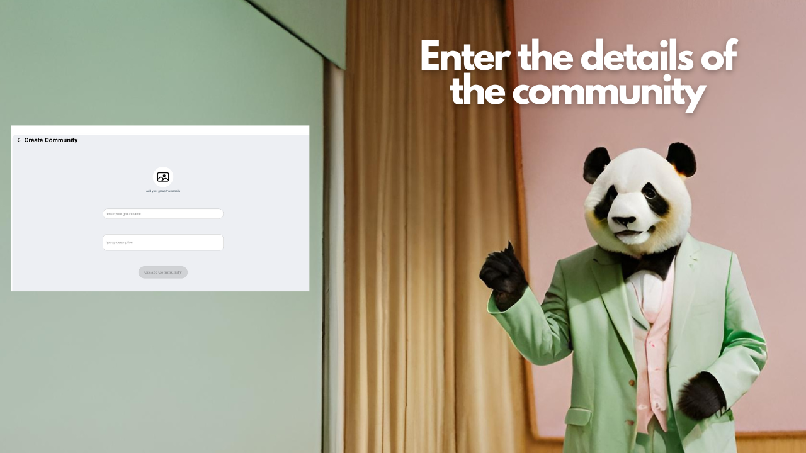

# Build your first community

Here is a step by step guide to create your first community. Let's build this together!

**Step 1:** Click on the community tab on your home page.

<figure><figcaption></figcaption></figure>

**Step 2:** Enter the details of your community. What is your pick today?

<figure><figcaption></figcaption></figure>

**Step 3:** Click on create community and start inviting your members!

<figure><figcaption></figcaption></figure>

In case of any queries, feel free to contact us. write us to mani@wato.ai
