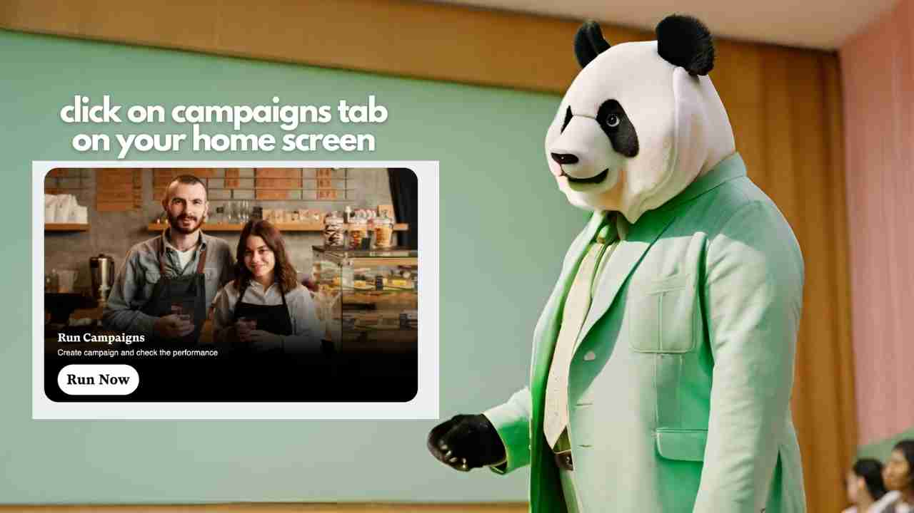
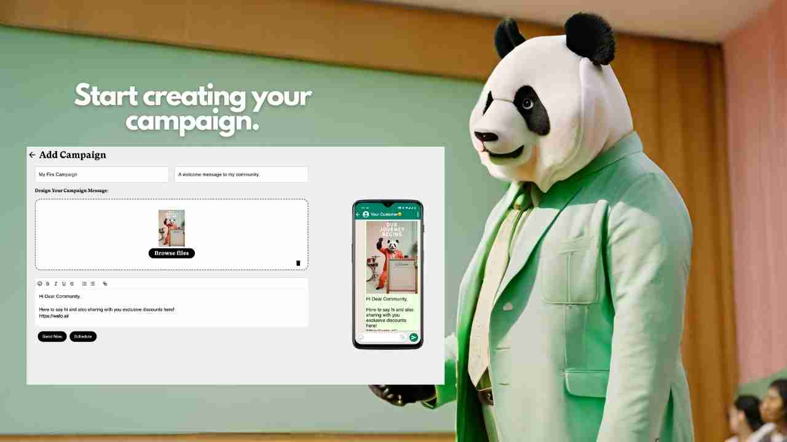
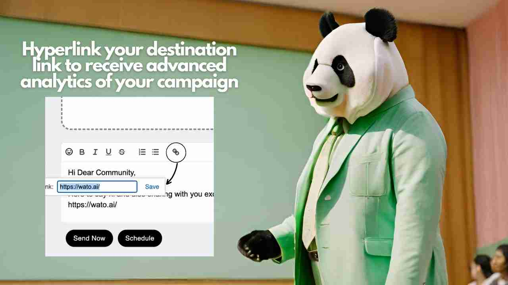
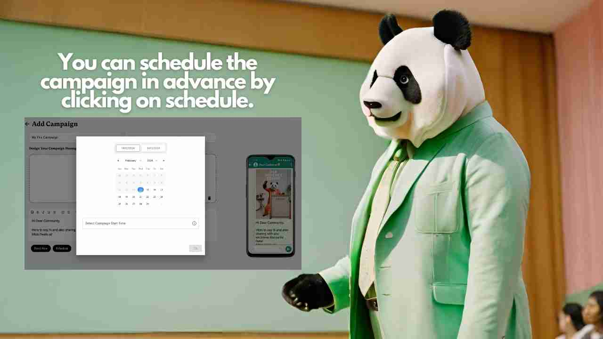
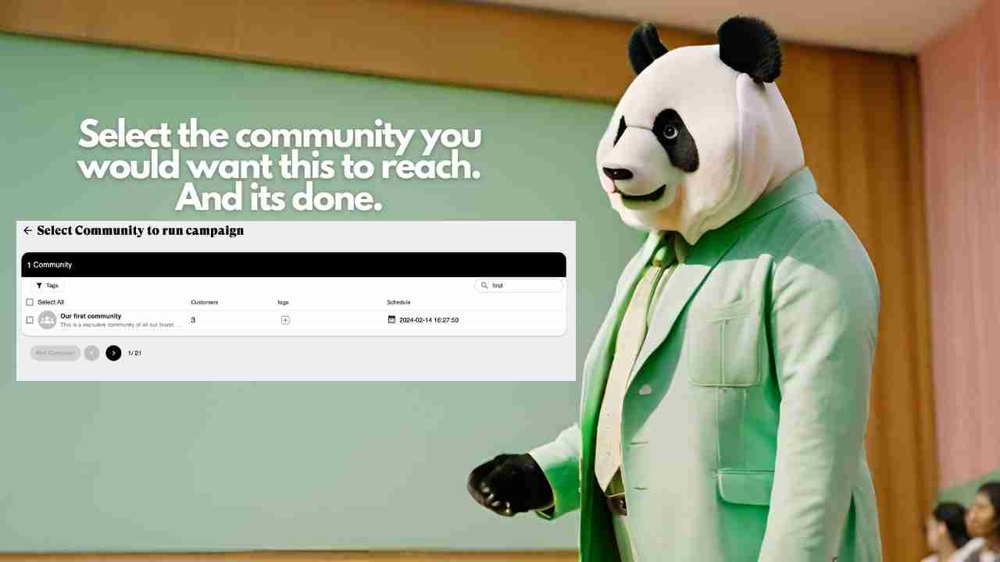
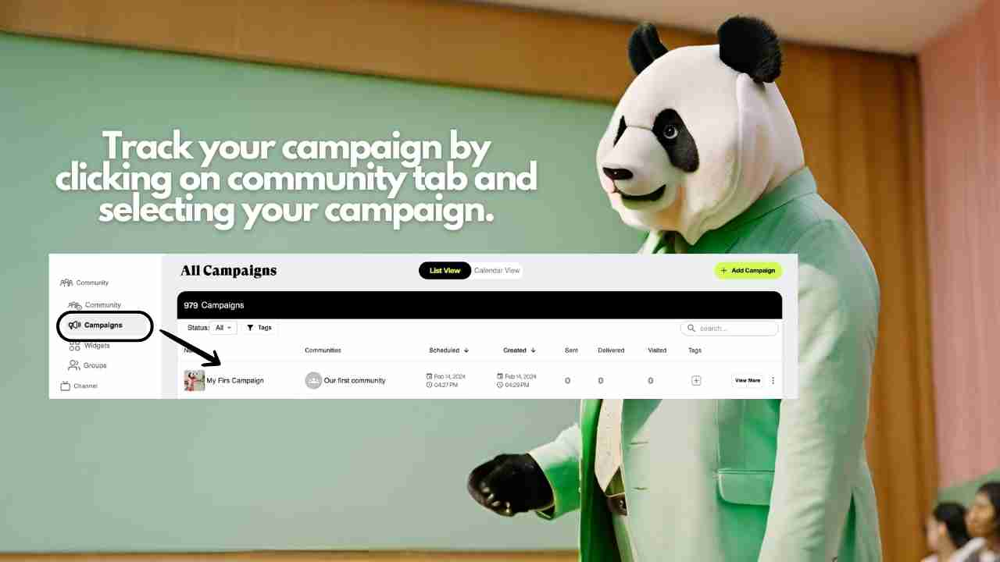

# Create your first campaign

<figure><figcaption></figcaption></figure>

Here is a step by step guide to create your first campaign.

**Step 1:** Click on the campaigns tab on your home screen.

<figure><figcaption></figcaption></figure>

**Step 2:** Fill in the details of the campaign and watch it live on the screen beside.

<figure><figcaption></figcaption></figure>

**Step 3:** Do not forget to hyperlink your destination link. It will help you with detailed tracking and measurement.

<figure><figcaption></figcaption></figure>

**Step 4:** You can schedule the campaign later or send it now.

<figure><figcaption></figcaption></figure>

**Step 5:** Select you community/ communities where you want to send the campaign to.

<figure><figcaption></figcaption></figure>

**Step 6:** Post delivery you can measure the success of your campaign through the campaigns tab by selecting your campaign.

<figure><figcaption></figcaption></figure>

In case of any queries, feel free to contact us. write us to mani@wato.ai
